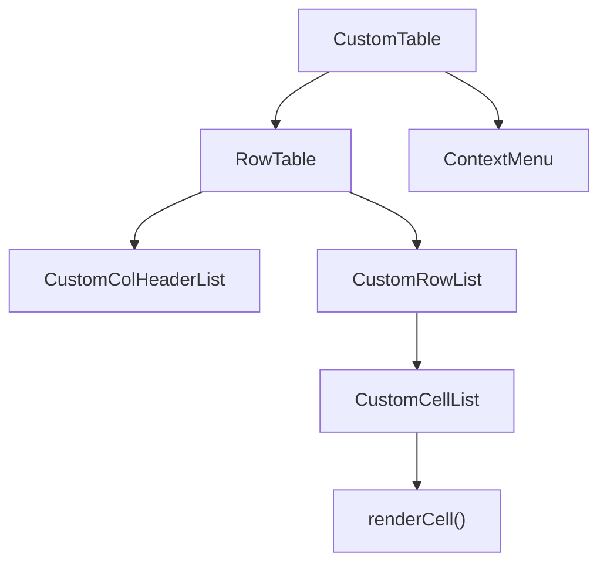
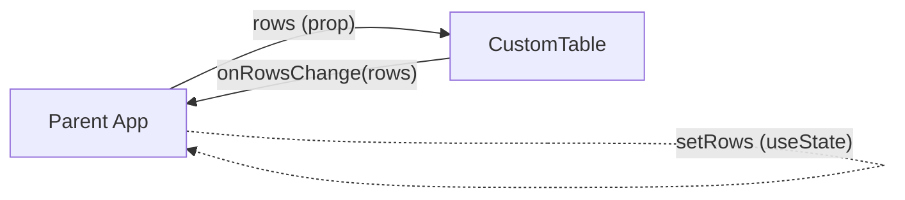

# CustomTable

A powerful, spreadsheet-like React table component built with TypeScript. It renders a **native HTML `<table>`** without virtualisation/windowing, leaving the layout entirely to the browser for pixel-perfect rendering.

> **Live Demo:** <https://sebastianbaltes.github.io/customtable/>

---

## Table of Contents

- [Features](#features)
- [Installation](#installation)
- [Quick Start](#quick-start)
- [Architecture](#architecture)
  - [Component Tree](#component-tree)
  - [Data Flow](#data-flow)
  - [Cursor & Selection (Direct DOM Updates)](#cursor--selection-direct-dom-updates)
  - [Filter & Sort (Controlled / Uncontrolled)](#filter--sort-controlled--uncontrolled)
  - [Cell Meta State](#cell-meta-state)
  - [Async Callbacks & Rollback](#async-callbacks--rollback)
  - [Undo / Redo](#undo--redo)
- [API Reference](#api-reference)
  - [CustomTable Props](#customtable-props)
  - [ColumnConfig\<T\>](#columnconfigt)
  - [Editor\<T\>](#editort)
  - [CellMetaMap / CellMeta / RowMeta](#cellmetamap--cellmeta--rowmeta)
  - [SortConfig](#sortconfig)
  - [FilterState](#filterstate)
- [Built-in Editors](#built-in-editors)
- [Custom Editors](#custom-editors)
- [Backend Integration Guide](#backend-integration-guide)
- [Design Decisions](#design-decisions)
- [Development](#development)
- [License](#license)

---

## Features

| Feature | Description |
| --- | --- |
| **Spreadsheet-style editing** | Click or press Enter/F2 to edit cells in-place |
| **Keyboard navigation** | Arrow keys, Tab, Home, End, Page Up/Down |
| **Multi-cell selection** | Shift+Arrow for range selection, click-drag |
| **Fill drag** | Excel-style fill handle to copy values across cells |
| **Copy & Paste** | Ctrl+C / Ctrl+V with tab-separated clipboard (Excel-compatible) |
| **Undo / Redo** | Ctrl+Z / Ctrl+Y with full row-snapshot stack |
| **Sorting** | Click column headers to cycle ASC → DESC → none |
| **Filtering** | Per-column text filter in each header |
| **Controlled filter/sort** | Optionally control sort & filter state from outside for backend-driven data |
| **Row creation & deletion** | Toolbar for row creation, context menu for deletion |
| **Multiple sticky columns** | Any number of left-pinned columns |
| **Cell & Row meta state** | Styles, CSS classes, title attributes, and disabled state per cell/row |
| **Async callbacks with rollback** | `onCreateRows`, `onUpdateRows`, `onDeleteRows` may return Promises; on rejection the table rolls back |
| **Context menu** | Right-click menu with copy, paste, delete, remove rows |
| **Built-in editors** | String, Number, Boolean (checkbox), Combobox (select), MultiCombobox |
| **Custom editors** | Provide your own editor component per column |
| **Validation** | Per-column `validate` function with warning/error severity |

---

## Installation

```bash
npm install customtable
```

**Peer dependencies:** `react >= 18`, `react-dom >= 18`

The package ships TypeScript sources and type declarations.

---

## Quick Start

```tsx
import React, { useState } from "react";
import { CustomTable, ColumnConfig, Row } from "customtable";
// Import the default styles (or provide your own):
import "customtable/src/examples/styles.css";

const columns: ColumnConfig<any>[] = [
  { name: "id",   type: "Number",  readOnly: true },
  { name: "name", type: "String",  required: true },
  { name: "role", type: "Combobox", selectOptions: ["Admin", "User", "Guest"] },
  { name: "active", type: "Boolean" },
];

const initialRows: Row[] = [
  { id: "1", name: "Alice", role: "Admin",  active: true },
  { id: "2", name: "Bob",   role: "User",   active: false },
  { id: "3", name: "Carol", role: "Guest",  active: true },
];

export const App = () => {
  const [rows, setRows] = useState(initialRows);

  return (
    <CustomTable
      rows={rows}
      columns={columns}
      onRowsChange={setRows}
      rowKey={(row) => row.id}
      numberOfStickyColums={1}
    />
  );
};
```

---

## Architecture

### Component Tree



### Data Flow

CustomTable follows the **Controlled Component** pattern. It does **not** own the data:



Die grafische Darstellung oben zeigt die beiden Richtungen: die Daten kommen als Prop von der Parent-App, Änderungen werden über `onRowsChange` zurückgemeldet.
Every data mutation inside the table (cell edit, paste, delete, fill drag, create rows, delete rows) produces a **new `Row[]` array** and calls:

1. **`onRowsChange(newRows)`** — always called with the complete new array.
2. **`onUpdateRows(changedRows)`** / **`onCreateRows(newRows)`** / **`onDeleteRows(removedRows)`** — called with only the affected rows, suitable for targeted backend operations.

The table never mutates the `rows` prop directly. The parent must accept the new array via `onRowsChange` and feed it back.

### Cursor & Selection (Direct DOM Updates)

For performance, cursor movement does **not** trigger React re-renders. Instead, the `useCursor` hook maintains a mutable `cursorRef` and updates CSS classes directly on DOM elements via `directDomUpdateForCursor`. A React state re-render is only triggered when the editing state changes (to mount/unmount the editor component).

The selection rectangle and fill rectangle are absolutely positioned `<div>` overlays whose positions are computed from the bounding rects of the underlying `<td>` elements.

### Filter & Sort (Controlled / Uncontrolled)

Filter and sort support two modes:

**Uncontrolled (default):** The table manages `sortConfig` and `filters` internally. Filtering and sorting are computed client-side in a `useMemo` over the `rows` array.

**Controlled:** Pass `sortConfig` and/or `filters` as props. In this mode:
- The internal state is bypassed.
- User interactions call `onSortChange(config)` / `onFilterChange(filters)` instead of setting local state.
- The parent is responsible for performing the backend query and providing the resulting `rows`.

```tsx
// Controlled sort & filter example
const [sort, setSort] = useState<SortConfig>(null);
const [filters, setFilters] = useState<FilterState>({});
const [rows, setRows] = useState<Row[]>([]);

// Fetch from backend when sort/filter changes
useEffect(() => {
  fetchFromBackend(sort, filters).then(setRows);
}, [sort, filters]);

<CustomTable
  rows={rows}
  columns={columns}
  onRowsChange={setRows}
  sortConfig={sort}
  onSortChange={setSort}
  filters={filters}
  onFilterChange={setFilters}
/>
```

### Cell Meta State

The `cellMeta` prop provides a way to attach **styles, CSS classes, title attributes, and a disabled state** to individual cells or entire rows — without mixing this metadata into the row data.

```tsx
const cellMeta: CellMetaMap = {
  "row-key-3": {
    // Apply to the entire <tr>:
    __row: { style: { backgroundColor: "#fee" }, title: "This row has errors" },
    // Apply to a specific cell:
    name: {
      style: { backgroundColor: "#fdd" },
      title: "Name is required",
      className: "cell-error",
    },
    // Disable editing for a cell:
    role: { disabled: true, title: "Cannot change role" },
  },
};
```

- **`__row`** is a reserved key that targets the `<tr>` element (uses the `RowMeta` type).
- All other keys are column names and target the `<td>` element (uses the `CellMeta` type).
- `disabled: true` prevents the cell from entering edit mode and blocks `onChange`.
- The map is keyed by the value returned from the `rowKey` prop function.

### Async Callbacks & Rollback

`onCreateRows`, `onUpdateRows`, and `onDeleteRows` may return a **`Promise<void>`**. When they do:

1. The table enters a **pending state** (`pointerEvents: none`, opacity reduced).
2. On **resolve**: the pending state is cleared; the mutation is accepted.
3. On **reject**: the table **rolls back** to the row snapshot before the mutation.

```tsx
<CustomTable
  // ...
  onUpdateRows={async (updatedRows) => {
    await fetch("/api/rows", {
      method: "PATCH",
      body: JSON.stringify(updatedRows),
    });
    // On success: nothing to do — table already shows the new state.
    // On failure: throw an error → table rolls back automatically.
  }}
/>
```

### Undo / Redo

The `useUndoRedo` hook maintains two stacks of `Row[]` snapshots (undo and redo). Before every mutation, the current `rows` array is pushed onto the undo stack. `Ctrl+Z` pops the last snapshot and restores it; `Ctrl+Y` re-applies.

> **Note:** Undo/Redo is purely client-side. It does not interact with the async callbacks. A "redo" after a server-confirmed change will locally restore the old state without notifying the backend.

---

## API Reference

### CustomTable Props

| Prop | Type | Required | Default | Description |
| --- | --- | --- | --- | --- |
| `rows` | `Row[]` | ✅ | — | The data to display. Each row is a `Record<string, any>`. |
| `columns` | `ColumnConfig<any>[]` | ✅ | — | Column definitions. |
| `onRowsChange` | `(rows: Row[]) => void` | — | — | Called with the full new rows array after every mutation. |
| `onCreateRows` | `(rows: Row[]) => void \| Promise<void>` | — | — | Called with newly created rows. Reject to rollback. |
| `onUpdateRows` | `(rows: Row[]) => void \| Promise<void>` | — | — | Called with updated rows (cell edit, paste, fill, delete content). Reject to rollback. |
| `onDeleteRows` | `(rows: Row[]) => void \| Promise<void>` | — | — | Called with deleted rows. Reject to rollback. |
| `rowKey` | `(row: Row, index: number) => string` | — | `(_, i) => ""+i` | Stable key for each row. Used for React keys and `cellMeta` lookup. |
| `numberOfStickyColums` | `number` | — | `0` | Number of left-pinned (sticky) columns. |
| `sortConfig` | `SortConfig` | — | *(internal)* | Controlled sort state. Pass `undefined` for uncontrolled. |
| `onSortChange` | `(config: SortConfig) => void` | — | — | Called when the user changes the sort. Required when `sortConfig` is controlled. |
| `filters` | `FilterState` | — | *(internal)* | Controlled filter state (`Record<string, string>`). Pass `undefined` for uncontrolled. |
| `onFilterChange` | `(filters: FilterState) => void` | — | — | Called when the user changes a filter. Required when `filters` is controlled. |
| `cellMeta` | `CellMetaMap` | — | — | Meta information (styles, disabled, title) per cell/row. |

### ColumnConfig\<T\>

```ts
interface ColumnConfig<T> {
  name: string;              // Column key in the row record
  type: string;              // Editor type: "String" | "Number" | "Boolean" | "Combobox" | "MultiCombobox"
  label?: string;            // Display label (defaults to name)
  readOnly?: boolean;        // Prevent editing
  required?: boolean;        // Mark as required (for visual indication)
  editor?: Editor<T>;        // Custom editor component
  selectOptions?: string[];  // Options for Combobox / MultiCombobox
  enabledIf?: (row: Row) => boolean;  // Conditional enable
  validate?: (value: any) => boolean | ValidationResult;
  multiselect?: boolean;
  comment?: string;          // Tooltip or description
}
```

### Editor\<T\>

A custom editor is a function component receiving `EditorParams<T>`:

```ts
type EditorParams<T> = {
  value: T;
  row: Record<string, T>;
  editing: boolean;          // true when the cell is in edit mode
  columnConfig: ColumnConfig<T>;
  onChange: (value: T) => void;
};

type Editor<T> = (params: EditorParams<T>) => JSX.Element;
```

### CellMetaMap / CellMeta / RowMeta

```ts
interface CellMeta {
  style?: React.CSSProperties;
  className?: string;
  disabled?: boolean;       // Blocks editing and onChange
  title?: string;           // HTML title attribute (tooltip)
}

interface RowMeta {
  style?: React.CSSProperties;
  className?: string;
  title?: string;
}

interface CellMetaMap {
  [rowKey: string]: {
    __row?: RowMeta;                              // Applied to <tr>
    [columnName: string]: CellMeta | undefined;   // Applied to <td>
  };
}
```

### SortConfig

```ts
type SortConfig = { column: string; direction: "asc" | "desc" } | null;
```

### FilterState

```ts
type FilterState = Record<string, string>;  // column name → filter text
```

---

## Built-in Editors

| Type | Editor | Behaviour |
| --- | --- | --- |
| `"String"` | `StringEditor` | `<input type="text">` with focus/select on edit, commit on Enter/Tab/blur |
| `"Number"` | `NumberEditor` | `<input type="number">`, parses to number on commit |
| `"Boolean"` | `BooleanEditor` | `<input type="checkbox">`, toggles on click (always interactive) |
| `"Combobox"` | `ComboboxEditor` | `<select>` dropdown from `selectOptions` |
| `"MultiCombobox"` | `MultiComboboxEditor` | Checkbox-list dropdown for multi-select from `selectOptions` |

The editor is resolved in `renderCell.tsx`:
1. `columnConfig.editor` (custom) — if provided, used directly
2. `editorMap.get(columnConfig.type)` — built-in lookup
3. `StringEditor` — fallback

---

## Custom Editors

```tsx
import { Editor } from "customtable";

const ColorEditor: Editor<string> = ({ value, editing, onChange }) => {
  if (!editing) return <span style={{ color: value }}>{value}</span>;
  return (
    <input
      type="color"
      value={value || "#000000"}
      onChange={(e) => onChange(e.target.value)}
      onKeyDown={(e) => e.stopPropagation()} // important!
    />
  );
};

const columns = [
  { name: "color", type: "custom", editor: ColorEditor },
];
```

> **Important:** Always call `e.stopPropagation()` on `onKeyDown` in your editor to prevent the table's keyboard handler from intercepting your key events.

---

## Backend Integration Guide

CustomTable is designed to be a **view layer** for backend-managed data. Here's the recommended integration pattern:

### 1. Controlled Sort & Filter → Backend Query

```tsx
const [sort, setSort] = useState<SortConfig>(null);
const [filters, setFilters] = useState<FilterState>({});
const [rows, setRows] = useState<Row[]>([]);

useEffect(() => {
  api.fetchRows({ sort, filters }).then(setRows);
}, [sort, filters]);

<CustomTable
  rows={rows}
  columns={columns}
  onRowsChange={setRows}
  sortConfig={sort}
  onSortChange={setSort}
  filters={filters}
  onFilterChange={setFilters}
/>
```

### 2. Granular Change Events → Backend Mutations

```tsx
<CustomTable
  rows={rows}
  columns={columns}
  onRowsChange={setRows}
  onCreateRows={async (newRows) => {
    const created = await api.createRows(newRows);
    // Optionally update rows with server-assigned IDs
  }}
  onUpdateRows={async (updatedRows) => {
    await api.updateRows(updatedRows);
  }}
  onDeleteRows={async (deletedRows) => {
    await api.deleteRows(deletedRows.map(r => r.id));
  }}
/>
```

### 3. Cell Meta for Error States

After server validation:

```tsx
const [cellMeta, setCellMeta] = useState<CellMetaMap>({});

const handleUpdate = async (updatedRows: Row[]) => {
  try {
    await api.updateRows(updatedRows);
    // Clear errors for updated rows
  } catch (error) {
    // Set error meta from server response
    const newMeta: CellMetaMap = {};
    for (const err of error.fieldErrors) {
      newMeta[err.rowKey] = {
        ...newMeta[err.rowKey],
        [err.column]: {
          style: { backgroundColor: "#fdd" },
          title: err.message,
          className: "cell-error",
        },
      };
    }
    setCellMeta(newMeta);
    throw error; // Triggers rollback
  }
};

<CustomTable cellMeta={cellMeta} onUpdateRows={handleUpdate} /* ... */ />
```

---

## Design Decisions

### Native HTML Table (No Virtualisation)

The component renders a real `<table>` element. This means:
- **Pro:** The browser handles column width calculation, text wrapping, and all layout natively — no complex width measurement code.
- **Pro:** Full CSS control; standard table styling works out of the box.
- **Pro:** Sticky columns use native `position: sticky` on `<td>` and `<th>`.
- **Con:** Not suitable for tens of thousands of rows. Use **pagination** at the application level for large datasets.

### Cursor via Direct DOM Manipulation

Moving the cursor with arrow keys must feel instant. Re-rendering the entire table on every keypress would be too slow. Therefore:
- `cursorRef` is a **mutable ref**, not state.
- `directDomUpdateForCursor` applies CSS class changes and positions the selection overlay directly on the DOM.
- A React state update (`setEditingCell`) is only triggered when the editing state changes, to mount/unmount the actual editor component.

### Separation of Data and Meta State

Row data (`rows`) and presentation metadata (`cellMeta`) are deliberately separate:
- Row data is the source of truth for business logic.
- `cellMeta` is transient UI state (error highlighting, disabled cells) that can change independently.
- The `cellMeta` map is keyed by `rowKey` output, making it stable across sort/filter changes.

### Immutable Row Updates

Every mutation creates a new `Row[]` array with shallow-copied rows for the changed entries. This is intentional:
- Works with React's reconciliation (reference equality checks).
- `onRowsChange` always receives a fresh array that can be directly set as state.
- The old array is preserved for undo snapshots.

### Optimistic Updates with Async Rollback

The table applies changes immediately (optimistic update) and only rolls back if the async callback rejects. This provides the best UX: the user sees changes instantly, and errors are handled gracefully.

---

## Development

### Prerequisites

- Node.js ≥ 18
- npm ≥ 9

### Setup

```bash
git clone <repo-url>
cd customtable
npm install
```

### Dev Server

```bash
npm start
# Opens Vite dev server at http://localhost:5173
```

### Build Demo

```bash
npm run build-demo
# Output in docs/
```

### TypeScript Check

```bash
npx tsc --noEmit
```

### E2E Tests (Playwright)

```bash
npx playwright install   # first time only
npm run test:e2e
```

### Project Structure

```
src/
├── index.ts                  — Public API exports
├── core/
│   ├── Types.ts              — All TypeScript types/interfaces
│   ├── CustomTable.tsx        — Main component
│   ├── RowTable.tsx           — Table rendering (<table>, <thead>, <tbody>)
│   ├── CustomColHeader.tsx    — Column header (sort + filter)
│   ├── CustomRow.tsx          — Row rendering (<tr>)
│   ├── CustomCell.tsx         — Cell rendering (<td>)
│   ├── renderCell.tsx         — Editor resolution
│   ├── EditorMap.tsx          — Built-in editor registry
│   ├── useCursor.tsx          — Cursor state management
│   ├── useCursorKeys.tsx      — Keyboard navigation
│   ├── directDomUpdateForCursor.tsx — Direct DOM updates for cursor
│   ├── useContextMenu.tsx     — Right-click context menu
│   ├── useUndoRedo.ts         — Undo/Redo stack
│   ├── useGridResizeChecker.ts
│   ├── useStickColumnLeftsChecker.ts
│   ├── usePositionInsideViewport.tsx
│   ├── useWindowSize.tsx
│   └── utils.ts
├── editors/
│   ├── StringEditor.tsx
│   ├── NumberEditor.tsx
│   ├── BooleanEditor.tsx
│   ├── ComboboxEditor.tsx
│   └── MultiComboboxEditor.tsx
└── examples/
    ├── example.tsx            — Demo application
    ├── index.html
    └── styles.css             — Default stylesheet
tests/
└── customtable.spec.ts        — Playwright E2E tests
```

---

## License

MIT — see [license.md](license.md)
