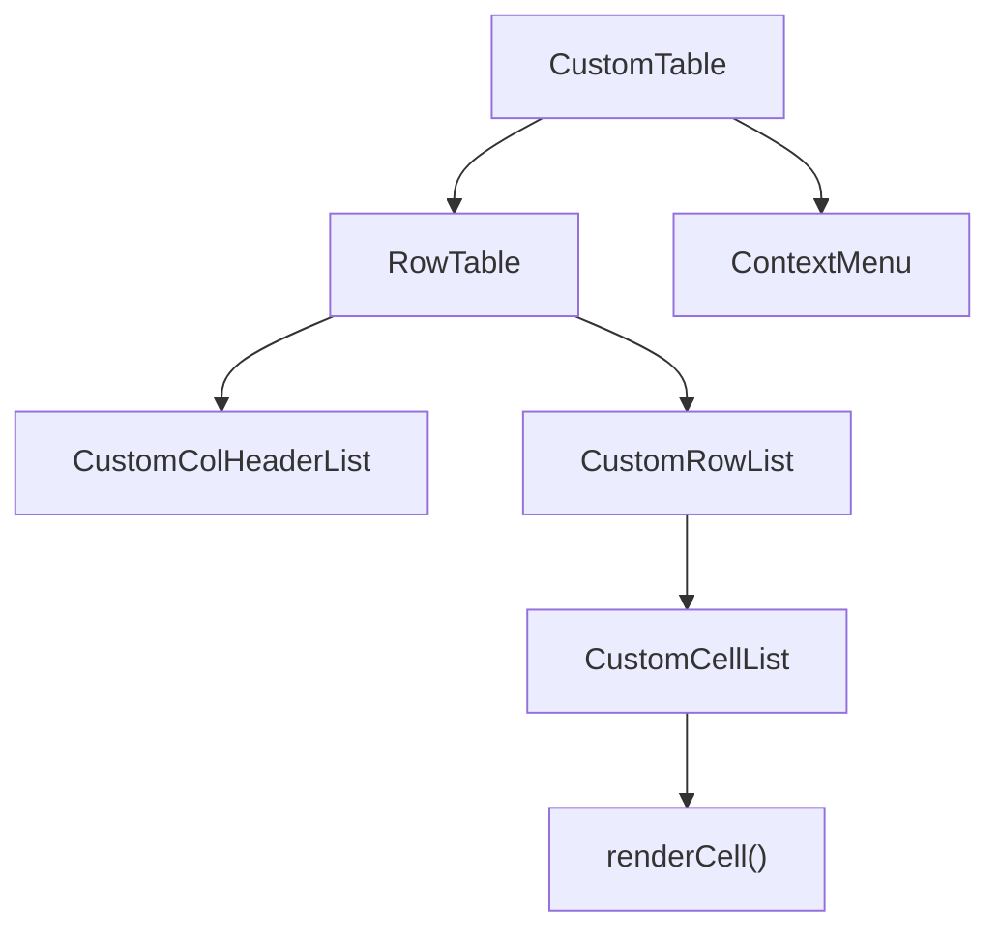
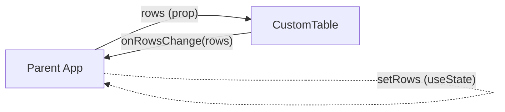

# CustomTable


A powerful Schema-bound Data Grid for React, designed for high-efficiency bulk-editing of structured datasets.

Unlike a free-form spreadsheet (like Excel), CustomTable is built specifically as a tabular CRUD interface for databases.
It combines the speed of keyboard-driven spreadsheet interaction with the data integrity of a fixed schema.
It is the ideal middle ground between a rigid single-record form and a chaotic, unstructured spreadsheet.

By utilizing a native HTML `<table>` instead of virtualization, CustomTable ensures a pixel-perfect layout and seamless CSS styling. While ideal for small to medium datasets, it can easily handle larger data through standard pagination.

> **Live Demo:** <https://sebastianbaltes.github.io/customtable/>

---

## Table of Contents

- [Features](#features)
- [Installation](#installation)
- [Quick Start](#quick-start)
- [Architecture](#architecture)
  - [Component Tree](#component-tree)
  - [Data Flow](#data-flow)
  - [Cursor & Selection (Direct DOM Updates)](#cursor--selection-direct-dom-updates)
  - [Filter & Sort (Controlled / Uncontrolled)](#filter--sort-controlled--uncontrolled)
  - [Cell Meta State](#cell-meta-state)
  - [Async Callbacks & Rollback](#async-callbacks--rollback)
  - [Undo / Redo](#undo--redo)
- [API Reference](#api-reference)
  - [CustomTable Props](#customtable-props)
  - [ColumnConfig\<T\>](#columnconfigt)
  - [NumberFormat](#numberformat)
  - [Editor\<T\>](#editort)
  - [CellMetaMap / CellMeta / RowMeta](#cellmetamap--cellmeta--rowmeta)
  - [SortConfig](#sortconfig)
  - [FilterState](#filterstate)
  - [TableTranslations](#tabletranslations)
  - [CustomContextMenuItem & TableContextState](#customcontextmenuitem--tablecontextstate)
- [Built-in Editors](#built-in-editors)
  - [Number Editor](#number-editor)
  - [Combobox & MultiCombobox](#combobox--multicombobox)
  - [Boolean Editor](#boolean-editor)
- [Custom Editors](#custom-editors)
- [Extensible Context Menu](#extensible-context-menu)
- [Internationalisation (i18n)](#internationalisation-i18n)
- [Backend Integration Guide](#backend-integration-guide)
  - [Controlled Sort & Filter → Backend Query](#1-controlled-sort--filter---backend-query)
  - [Granular Change Events → Backend Mutations](#2-granular-change-events---backend-mutations)
  - [Cell Meta for Error States](#3-cell-meta-for-error-states)
- [Design Decisions](#design-decisions)
  - [Native HTML Table (No Virtualisation)](#native-html-table-no-virtualisation)
  - [Cursor via Direct DOM Manipulation](#cursor-via-direct-dom-manipulation)
  - [Separation of Data and Meta State](#separation-of-data-and-meta-state)
  - [Immutable Row Updates](#immutable-row-updates)
  - [Optimistic Updates with Async Rollback](#optimistic-updates-with-async-rollback)
- [Development](#development)
  - [Prerequisites](#prerequisites)
  - [Setup](#setup)
  - [Dev Server](#dev-server)
  - [Build Demo](#build-demo)
  - [TypeScript Check](#typescript-check)
  - [E2E Tests (Playwright)](#e2e-tests-playwright)
  - [Project Structure](#project-structure)
- [Theming](#theming)
- [Comparison: CustomTable vs. Others](#comparison-customtable-vs-others)
- [When to use CustomTable](#when-to-use-customtable)
- [When to use something else](#when-to-use-something-else)
- [License](#license)

---

## Features

| Feature                           | Description                                                                                                 |
| --------------------------------- | ----------------------------------------------------------------------------------------------------------- |
| **Spreadsheet-style editing**     | Click or press Enter/F2 to edit, **Escape to cancel**                                                       |
| **Keyboard navigation**           | Arrow keys, Tab, Home, End, Page Up/Down                                                                    |
| **Multi-cell selection**          | Shift+Arrow for range selection, click-drag                                                                 |
| **Ellipsis text display**         | Auto-truncate long text values with a configurable length                                                   |
| **Fill drag**                     | Excel-style fill handle to copy values across cells                                                         |
| **Copy & Paste**                  | Ctrl+C / Ctrl+V with tab-separated clipboard (Excel-compatible)                                             |
| **Undo / Redo**                   | Ctrl+Z / Ctrl+Y with full row-snapshot stack                                                                |
| **Sorting**                       | Click column headers to cycle ASC → DESC → none                                                             |
| **Filtering**                     | Per-column text/select filter in each header; Boolean columns get a Yes/No select                           |
| **Filterable flag**               | Set `filterable: false` on a column to hide its filter input entirely                                       |
| **Custom filter editor**          | Supply a `filterEditor` component per column to replace the built-in filter input                           |
| **Controlled filter/sort**        | Optionally control sort & filter state from outside for backend-driven data                                 |
| **Row creation & deletion**       | Toolbar for row creation; context menu for insertion above/below and deletion                               |
| **Multiple sticky columns**       | Any number of left-pinned columns                                                                           |
| **Cell & Row meta state**         | Styles, CSS classes, title attributes, and disabled state per cell/row                                      |
| **Async callbacks with rollback** | `onCreateRows`, `onUpdateRows`, `onDeleteRows` may return Promises; on rejection the table rolls back       |
| **Number formatting**             | Locale-aware display with configurable decimal places, thousands separator, prefix/suffix                   |
| **Cell alignment**                | Per-column `align` override; Number columns default to right-aligned                                        |
| **Context menu**                  | Right-click menu with insert row, remove rows, copy, paste, delete content — right-click also selects cells |
| **Extensible context menu**       | Add custom items that receive a full snapshot of the table state at click time                              |
| **ARIA-conformant focus**         | Table initializes cursor to (0,0) on focus; deselects all cells on blur                                     |
| **Combobox shows all options**    | Combobox popover shows all options on open; filters only when user types                                    |
| **Combobox click-to-close**       | Clicking any option in a single-select Combobox commits and closes the popover                              |
| **Combobox keyboard UX**          | Arrow keys navigate options, Enter selects, Space toggles (multi-select), free-text entry                   |
| **Boolean keyboard UX**           | Enter on a selected Boolean cell toggles its value without entering edit mode                               |
| **i18n / translations**           | All built-in UI strings are overridable via a typesafe `translations` prop                                  |
| **Built-in editors**              | String, Number, Boolean (checkbox), Combobox (single-select), MultiCombobox (multi-select)                  |
| **Custom editors**                | Provide your own editor component per column                                                                |
| **Validation**                    | Per-column `validate` function with warning/error severity                                                  |
| **Theming**                       | 6 built-in themes; custom themes are plain CSS files with CSS custom properties                             |

---

## Theming

CustomTable ships with six ready-made themes and a simple CSS-variable-based theming system that makes it easy to create your own.

### Built-in Themes

| Theme             | Description                                                                               |
| ----------------- | ----------------------------------------------------------------------------------------- |
| **Light**         | Clean, neutral default theme                                                              |
| **Dark**          | Dark backgrounds, light text, styled scrollbars                                           |
| **Excel Classic** | Traditional Microsoft Excel look — gray headers, green accents                            |
| **Google Sheets** | White and blue, thin borders, Roboto-like font                                            |
| **Material**      | MUI DataTable style — borderless cells, row dividers, elevation shadows, generous padding |
| **Numbers**       | Apple Numbers style — alternating row stripes, subtle colors                              |

### Custom Themes

A theme is just a CSS file that sets CSS custom properties on `:root`. The structural layout (positioning, flexbox, overflow, z-index) lives in `core/base.css` and never needs to change — a theme only controls the visual appearance: colors, borders, fonts, padding, shadows.

```css
/* my-theme.css */
:root {
  --ct-bg: #fff;
  --ct-text: #333;
  --ct-font: "My Font", sans-serif;
  --ct-border: #ddd;
  --ct-header-bg: #f5f5f5;
  --ct-selected-outline: #0066cc;
  /* … see any built-in theme for the full list of variables */
}
```

To apply a theme, simply import or inject its CSS after `base.css`. The example app demonstrates runtime theme switching by injecting the selected theme's CSS into a `<style>` tag — but for most use cases a static CSS import is all you need.

---

## Installation

```bash
npm install customtable
```

**Peer dependencies:** `react >= 18`, `react-dom >= 18`

## Dependencies

Runtime dependencies (as shipped in package.json):

- `react` ^18.2.0
- `react-dom` ^18.2.0

Dev dependencies used for development and building the demo:

- `@playwright/test` ^1.58.2
- `@types/jest` ^29.5.3
- `@types/react` ^18.2.15
- `@types/react-dom` ^18.2.7
- `@vitejs/plugin-react` ^6.0.1
- `prettier` ^3.0.0
- `process` ^0.11.10
- `react-test-renderer` ^18.2.0
- `typescript` ^5.1.6
- `vite` ^8.0.3

Minimum tooling versions (recommended):

- Node.js >= 18
- npm >= 9

These are the packages used in this repository and declared in `package.json`. When consuming the package as a dependency, only the runtime dependencies and peer dependencies are required in the host project.

The package ships TypeScript sources and type declarations.

---

## Quick Start

```tsx
import React, { useState } from "react";
import { CustomTable, ColumnConfig, Row } from "customtable";
// Import the default styles (or provide your own):
import "customtable/src/examples/styles.css";

const columns: ColumnConfig<any>[] = [
  { name: "id", type: "Number", readOnly: true, numberFormat: { decimalPlaces: 0 } },
  { name: "name", type: "String", required: true },
  {
    name: "salary",
    type: "Number",
    numberFormat: { decimalPlaces: 2, thousandsSeparator: true, suffix: " €" },
  },
  { name: "role", type: "Combobox", selectOptions: ["Admin", "User", "Guest"] },
  { name: "active", type: "Boolean" },
];

const initialRows: Row[] = [
  { id: 1, name: "Alice", salary: 72000, role: "Admin", active: true },
  { id: 2, name: "Bob", salary: 58000, role: "User", active: false },
  { id: 3, name: "Carol", salary: 64500, role: "Guest", active: true },
];

export const App = () => {
  const [rows, setRows] = useState(initialRows);

  return (
    <CustomTable
      rows={rows}
      columns={columns}
      onRowsChange={setRows}
      rowKey={(row) => row.id}
      numberOfStickyColums={1}
    />
  );
};
```

---

## Architecture

### Component Tree



### Data Flow

CustomTable follows the **Controlled Component** pattern. It does **not** own the data:



The diagram above illustrates the two-way data flow: data is passed down as props from the parent application, and any changes are reported back via the `onRowsChange` callback.
Every data mutation inside the table (cell edit, paste, delete, fill drag, create rows, delete rows) produces a **new `Row[]` array** and calls:

1. **`onRowsChange(newRows)`** — always called with the complete new array.
2. **`onUpdateRows(changedRows)`** / **`onCreateRows(newRows)`** / **`onDeleteRows(removedRows)`** — called with only the affected rows, suitable for targeted backend operations.

The table never mutates the `rows` prop directly. The parent must accept the new array via `onRowsChange` and feed it back.

### Cursor & Selection (Direct DOM Updates)

For performance, cursor movement does **not** trigger React re-renders. Instead, the `useCursor` hook maintains a mutable `cursorRef` and updates CSS classes directly on DOM elements via `directDomUpdateForCursor`. A React state re-render is only triggered when the editing state changes (to mount/unmount the editor component).

The selection rectangle and fill rectangle are absolutely positioned `<div>` overlays whose positions are computed from the bounding rects of the underlying `<td>` elements.

### Filter & Sort (Controlled / Uncontrolled)

Filter and sort support two modes:

**Uncontrolled (default):** The table manages `sortConfig` and `filters` internally. Filtering and sorting are computed client-side in a `useMemo` over the `rows` array.

**Controlled:** Pass `sortConfig` and/or `filters` as props. In this mode:

- The internal state is bypassed.
- User interactions call `onSortChange(config)` / `onFilterChange(filters)` instead of setting local state.
- The parent is responsible for performing the backend query and providing the resulting `rows`.

```tsx
// Controlled sort & filter example
const [sort, setSort] = useState<SortConfig>(null);
const [filters, setFilters] = useState<FilterState>({});
const [rows, setRows] = useState<Row[]>([]);

// Fetch from backend when sort/filter changes
useEffect(() => {
  fetchFromBackend(sort, filters).then(setRows);
}, [sort, filters]);

<CustomTable
  rows={rows}
  columns={columns}
  onRowsChange={setRows}
  sortConfig={sort}
  onSortChange={setSort}
  filters={filters}
  onFilterChange={setFilters}
/>;
```

### Cell Meta State

The `cellMeta` prop provides a way to attach **styles, CSS classes, title attributes, and a disabled state** to individual cells or entire rows — without mixing this metadata into the row data.

```tsx
const cellMeta: CellMetaMap = {
  "row-key-3": {
    // Apply to the entire <tr>:
    row: { style: { backgroundColor: "#fee" }, title: "This row has errors" },
    cells: {
      // Apply to a specific cell:
      name: {
        style: { backgroundColor: "#fdd" },
        title: "Name is required",
        className: "cell-error",
      },
      // Disable editing for a cell:
      role: { disabled: true, title: "Cannot change role" },
    },
  },
};
```

- **`row`** targets the `<tr>` element (uses the `RowMeta` type).
- **`cells`** is a map of column names targeting the `<td>` element (uses the `CellMeta` type).
- `disabled: true` prevents the cell from entering edit mode and blocks `onChange`.
- The map is keyed by the value returned from the `rowKey` prop function.

### Async Callbacks & Rollback

`onCreateRows`, `onUpdateRows`, and `onDeleteRows` may return a **`Promise<void>`**. When they do:

1. The table enters a **pending state** (`pointerEvents: none`, opacity reduced).
2. On **resolve**: the pending state is cleared; the mutation is accepted.
3. On **reject**: the table **rolls back** to the row snapshot before the mutation.

```tsx
<CustomTable
  // ...
  onUpdateRows={async (updatedRows) => {
    await fetch("/api/rows", {
      method: "PATCH",
      body: JSON.stringify(updatedRows),
    });
    // On success: nothing to do — table already shows the new state.
    // On failure: throw an error → table rolls back automatically.
  }}
/>
```

### Undo / Redo

The `useUndoRedo` hook maintains two stacks of `Row[]` snapshots (undo and redo). Before every mutation, the current `rows` array is pushed onto the undo stack. `Ctrl+Z` pops the last snapshot and restores it; `Ctrl+Y` re-applies.

When an undo or redo action occurs, the component automatically calculates the difference between the states and triggers the appropriate change callbacks (`onCreateRows`, `onUpdateRows`, `onDeleteRows`). It also fires the specific `onUndo` and `onRedo` callbacks if provided. All of these participate in the async rollback mechanism seamlessly, allowing you to transparently sync undo/redo actions with your backend.

---

## API Reference

### CustomTable Props

| Prop                    | Type                                              | Required | Default          | Description                                                                                                       |
| ----------------------- | ------------------------------------------------- | -------- | ---------------- | ----------------------------------------------------------------------------------------------------------------- |
| `rows`                  | `Row[]`                                           | ✅       | —                | The data to display. Each row is a `Record<string, any>`.                                                         |
| `columns`               | `ColumnConfig<any>[]`                             | ✅       | —                | Column definitions.                                                                                               |
| `onRowsChange`          | `(rows: Row[]) => void`                           | —        | —                | Called with the full new rows array after every mutation.                                                         |
| `onCreateRows`          | `(rows: Row[]) => void \| Promise<void>`          | —        | —                | Called with newly created rows. Reject to rollback.                                                               |
| `onUpdateRows`          | `(rows: Row[]) => void \| Promise<void>`          | —        | —                | Called with updated rows. Reject to rollback.                                                                     |
| `onDeleteRows`          | `(rows: Row[]) => void \| Promise<void>`          | —        | —                | Called with deleted rows. Reject to rollback.                                                                     |
| `onUndo`                | `(recoveredRows: Row[]) => void \| Promise<void>` | —        | —                | Called specifically when an undo is performed. Reject to rollback.                                                |
| `onRedo`                | `(recoveredRows: Row[]) => void \| Promise<void>` | —        | —                | Called specifically when a redo is performed. Reject to rollback.                                                 |
| `rowKey`                | `(row: Row, index: number) => string`             | —        | `(_, i) => ""+i` | Stable key for each row. Used for React keys and `cellMeta` lookup.                                               |
| `numberOfStickyColums`  | `number`                                          | —        | `0`              | Number of left-pinned (sticky) columns.                                                                           |
| `sortConfig`            | `SortConfig`                                      | —        | _(internal)_     | Controlled sort state. Pass `undefined` for uncontrolled.                                                         |
| `onSortChange`          | `(config: SortConfig) => void`                    | —        | —                | Called when the user changes the sort. Required when `sortConfig` is controlled.                                  |
| `filters`               | `FilterState`                                     | —        | _(internal)_     | Controlled filter state. Pass `undefined` for uncontrolled.                                                       |
| `onFilterChange`        | `(filters: FilterState) => void`                  | —        | —                | Called when the user changes a filter. Required when `filters` is controlled.                                     |
| `cellMeta`              | `CellMetaMap`                                     | —        | —                | Meta information (styles, disabled, title) per cell/row.                                                          |
| `textEllipsisLength`    | `number`                                          | —        | —                | Truncates long text to this length with ` [...]` in display mode.                                                 |
| `translations`          | `Partial<TableTranslations>`                      | —        | English defaults | Override any built-in UI string. See [Internationalisation](#internationalisation-i18n).                          |
| `extraContextMenuItems` | `CustomContextMenuItem[]`                         | —        | `[]`             | Custom entries appended to the right-click context menu. See [Extensible Context Menu](#extensible-context-menu). |

### ColumnConfig\<T\>

```ts
interface ColumnConfig<T> {
  name: string; // Column key in the row record
  type: string; // "String" | "Number" | "Boolean" | "Combobox" | "MultiCombobox"
  label?: string; // Display label (defaults to name)
  readOnly?: boolean; // Prevent editing
  required?: boolean; // Mark as required (visual indication)
  editor?: Editor<T>; // Custom editor component (overrides type-based lookup)
  selectOptions?: string[]; // Option list for Combobox / MultiCombobox
  freeText?: boolean; // Allow custom values in Combobox/MultiCombobox (default: true)
  multiselect?: boolean; // Enable multi-select mode (used internally by MultiCombobox)
  enabledIf?: (row: Row) => boolean; // Conditional enable
  validate?: (value: any) => boolean | ValidationResult;
  numberFormat?: NumberFormat; // Display & parse format for Number columns
  align?: "left" | "right" | "center"; // Text alignment (Number defaults to "right")
  comment?: string; // Tooltip or description shown in column header
  filterable?: boolean; // Set to false to hide the filter input (default: true)
  filterEditor?: FilterEditor; // Custom filter component in the column header
}
```

### NumberFormat

Controls how `Number` columns are displayed and parsed. The raw JS `number` is always stored as-is in the row data; this only affects rendering.

```ts
interface NumberFormat {
  decimalPlaces?: number; // Fixed decimal places (undefined = Intl default)
  thousandsSeparator?: boolean; // Show thousands grouping separator (default: true)
  locale?: string; // BCP 47 locale, e.g. "de-DE", "en-US" (default: browser locale)
  prefix?: string; // Non-editable prefix, e.g. "$ " or "+ "
  suffix?: string; // Non-editable suffix, e.g. " €" or " %"
}
```

**Edit mode** shows the number as a formatted string (without prefix/suffix) in a `type="text"` input. Prefix and suffix are rendered as non-editable CSS `::before`/`::after` pseudo-elements. The input is parsed back on commit using the configured locale.

**Single-clicking** an already-selected Number cell enters edit mode and positions the text cursor at the exact click location.

```tsx
// Examples
{ name: "salary",  type: "Number", numberFormat: { decimalPlaces: 2, thousandsSeparator: true, suffix: " €" } }
{ name: "score",   type: "Number", numberFormat: { decimalPlaces: 1, thousandsSeparator: false } }
{ name: "bonus",   type: "Number", numberFormat: { decimalPlaces: 0, prefix: "+ ", suffix: " €" } }
{ name: "rate",    type: "Number", numberFormat: { locale: "de-DE", decimalPlaces: 2, suffix: " %" } }
```

### Editor\<T\>

A custom editor is a function component receiving `EditorParams<T>`:

```ts
type EditorParams<T> = {
  value: T;
  row: Record<string, T>;
  editing: boolean; // true when the cell is in edit mode
  columnConfig: ColumnConfig<T>;
  onChange: (value: T) => void;
  textEllipsisLength?: number; // The table-level truncation setting
  initialEditValue: string | null; // Character typed to open edit mode (e.g. "a"), or null
};

type Editor<T> = (params: EditorParams<T>) => JSX.Element;
```

`initialEditValue` is set when the user opens edit mode by typing a printable character directly. Use it to pre-fill the editor with that character so the keystroke is not lost.

### CellMetaMap / CellMeta / RowMeta

```ts
interface CellMeta {
  style?: React.CSSProperties;
  className?: string;
  disabled?: boolean; // Blocks editing and onChange
  title?: string; // HTML title attribute (tooltip)
}

interface RowMeta {
  style?: React.CSSProperties;
  className?: string;
  title?: string;
}

type CellMetaMap = Record<
  string,
  {
    row?: RowMeta; // Applied to <tr>
    cells?: Record<string, CellMeta>; // Applied to <td>, keyed by column name
  }
>;
```

### SortConfig

```ts
type SortConfig = { column: string; direction: "asc" | "desc" } | null;
```

### FilterState

```ts
type FilterState = Record<string, string>; // column name → filter text
```

### FilterEditor

A custom filter component rendered in the column header instead of the built-in `<input>` or Boolean `<select>`:

```ts
type FilterEditorParams = {
  value: string; // Current filter string
  onChange: (value: string) => void;
  column: ColumnConfig<any>;
};

type FilterEditor = (params: FilterEditorParams) => JSX.Element;
```

**Usage:**

```tsx
const MyRangeFilter: FilterEditor = ({ value, onChange }) => (
  <input
    type="number"
    value={value}
    placeholder="≥"
    onChange={e => onChange(e.target.value)}
    style={{ width: "100%" }}
  />
);

{ name: "salary", type: "Number", filterEditor: MyRangeFilter }
```

### TableTranslations

All built-in UI strings exposed as a typesafe interface. Pass a `Partial<TableTranslations>` to override any subset:

```ts
interface TableTranslations {
  "Create Rows": string; // Toolbar button
  "Enter or select...": string; // Single-select combobox placeholder
  "Filter or add value...": string; // Multi-select combobox placeholder
  "-- select --": string; // Combobox display when nothing is selected (freeText: false)
  "Press Enter to save": string; // Combobox empty-list hint (single)
  "Press Enter to add": string; // Combobox empty-list hint (multi)
  "Insert row above": string; // Context menu
  "Insert row below": string; // Context menu
  "Remove rows": string; // Context menu
  "Copy content": string; // Context menu
  "Paste content": string; // Context menu
  "Delete content": string; // Context menu
  Yes: string; // Boolean column filter option (truthy)
  No: string; // Boolean column filter option (falsy)
}
```

### CustomContextMenuItem & TableContextState

```ts
/** State snapshot passed to custom context-menu handlers at click time. */
interface TableContextState {
  selectionRange: { startRow: number; endRow: number; startCol: number; endCol: number };
  selectedRows: Row[]; // rows within the selection (display order)
  displayRows: Row[]; // all visible rows (after filtering/sorting)
  rows: Row[]; // all original rows (unfiltered)
  columns: ColumnConfig<any>[];
  cellMeta?: CellMetaMap;
}

type CustomContextMenuItem =
  | { label: string; shortcut?: string; onClick: (state: TableContextState) => void }
  | "---";
```

---

## Pagination Component

`Pagination` is a **standalone** component — it has no internal coupling to `CustomTable`. Use it to drive any paginated list or table, including `CustomTable`.

```tsx
import { Pagination } from "customtable";

<Pagination
  totalRows={300}
  page={currentPage}
  pageSize={pageSize}
  onPageChange={setPage}
  onPageSizeChange={(ps) => {
    setPageSize(ps);
    setPage(1);
  }}
/>;
```

### PaginationProps

| Prop               | Type                         | Default                         | Description                                                                                          |
| ------------------ | ---------------------------- | ------------------------------- | ---------------------------------------------------------------------------------------------------- |
| `totalRows`        | `number`                     | ✅                              | Total number of rows (used to compute page count). When filters are active, pass the filtered count. |
| `page`             | `number`                     | ✅                              | Current 1-based page number.                                                                         |
| `pageSize`         | `number`                     | ✅                              | Current page size. `0` means "all rows".                                                             |
| `onPageChange`     | `(page: number) => void`     | ✅                              | Called when a page button is clicked.                                                                |
| `onPageSizeChange` | `(pageSize: number) => void` | ✅                              | Called when the page-size select changes.                                                            |
| `pageSizeOptions`  | `number[]`                   | `[10,25,50,100,250,500,1000,0]` | Available page-size options. `0` is rendered as the "all" label.                                     |
| `maxVisiblePages`  | `number`                     | `20`                            | Max page buttons before collapsing to `…`.                                                           |
| `labels`           | `Partial<PaginationLabels>`  | —                               | Override display strings.                                                                            |
| `className`        | `string`                     | —                               | Additional CSS class on the root element.                                                            |

### PaginationLabels

```ts
interface PaginationLabels {
  page: string; // default: "Page"
  of: string; // default: "of"
  rows: string; // default: "rows"
  with: string; // default: "with"
  rowsPerPage: string; // default: "rows per page"
  all: string; // default: "All"  — label for pageSize === 0
}
```

### Pagination with filters spanning all rows

When using `CustomTable` in **controlled filter/sort mode** alongside `Pagination`, filter the full dataset in the parent and pass `filteredSorted.length` as `totalRows`:

```tsx
const filteredSorted = useMemo(() => {
  let result = allRows.map((row, origIdx) => ({ row, origIdx }));
  const active = Object.entries(filters).filter(([, v]) => v.trim() !== "");
  if (active.length) {
    result = result.filter(({ row }) =>
      active.every(([col, val]) =>
        String(row[col] ?? "").toLowerCase().includes(val.toLowerCase())
      )
    );
  }
  if (sortConfig) {
    const { column, direction } = sortConfig;
    result.sort((a, b) => {
      const av = a.row[column], bv = b.row[column];
      if (av == null && bv == null) return 0;
      if (av == null) return 1;
      if (bv == null) return -1;
      const cmp = String(av).localeCompare(String(bv), undefined, { numeric: true });
      return direction === "asc" ? cmp : -cmp;
    });
  }
  return result;
}, [allRows, filters, sortConfig]);

const effectivePageSize = pageSize === 0 ? filteredSorted.length || 1 : pageSize;
const start = (page - 1) * effectivePageSize;
const pageItems = filteredSorted.slice(start, start + effectivePageSize);

<CustomTable
  rows={pageItems.map(i => i.row)}
  // pass pre-filtered data + same controlled filters (filter is idempotent)
  filters={filters}
  sortConfig={sortConfig}
  ...
/>
<Pagination totalRows={filteredSorted.length} page={page} pageSize={pageSize} ... />
```

---

## Built-in Editors

| Type              | Editor                | Behaviour                                                                                    |
| ----------------- | --------------------- | -------------------------------------------------------------------------------------------- |
| `"String"`        | `StringEditor`        | `<input type="text">`. Commits on Enter/Tab/blur, cancels on Escape.                         |
| `"Number"`        | `NumberEditor`        | Locale-aware formatted text input. See [Number Editor](#number-editor).                      |
| `"Boolean"`       | `BooleanEditor`       | Checkbox — always interactive. Enter on a selected cell toggles without entering edit mode.  |
| `"Combobox"`      | `ComboboxEditor`      | Searchable single-select dropdown. See [Combobox & MultiCombobox](#combobox--multicombobox). |
| `"MultiCombobox"` | `MultiComboboxEditor` | Multi-select variant of Combobox.                                                            |

The editor is resolved in `renderCell.tsx`:

1. `columnConfig.editor` (custom) — if provided, used directly
2. `editorMap.get(columnConfig.type)` — built-in lookup
3. `StringEditor` — fallback

### Number Editor

Number cells are **right-aligned** by default. In display mode the value is formatted using `Intl.NumberFormat` according to the column's `NumberFormat` config. Prefix/suffix are rendered as non-editable decorations.

In edit mode:

- A `type="text"` input shows the numeric part only (no prefix/suffix).
- Prefix/suffix are shown via CSS `::before`/`::after` on a wrapper element.
- The value is parsed back locale-awarely on commit.
- **Single-clicking** an already-selected cell places the text cursor at the exact click position (canvas text-measurement).
- **Typing a digit** while a cell is selected opens edit mode and pre-fills that character.
- **Enter/F2/double-click** opens edit mode and selects all text for quick replacement.

### Combobox & MultiCombobox

Both editor types share the same dropdown component. Cells show a `▾` indicator in the right margin; clicking within 2 rem of the right edge opens the dropdown directly.

**Keyboard contract while the dropdown is open:**

| Key                                   | Single-select                          | Multi-select                                    |
| ------------------------------------- | -------------------------------------- | ----------------------------------------------- |
| `ArrowDown` / `ArrowUp`               | Move option highlight                  | Move option highlight                           |
| `Enter` (option highlighted)          | Select option, advance to next row     | Toggle option, commit, advance to next row      |
| `Enter` (no highlight, input empty)   | Commit typed text, advance to next row | Commit selection, advance to next row           |
| `Enter` (no highlight, text in input) | Commit typed text                      | Add as custom entry, stay in edit mode          |
| `Space`                               | —                                      | Toggle highlighted option (no immediate commit) |
| `Tab`                                 | Commit and advance to next cell        | Commit and advance to next cell                 |
| `Escape`                              | Exit edit mode, discard changes        | Exit edit mode, discard changes                 |

**`freeText` option** (default: `true`): when `true`, the user may type values not present in `selectOptions`. The typed text can be committed as a custom entry. Set to `false` to restrict input to the predefined option list only.

**Multi-select buffering:** Toggles in multi-select mode are buffered locally and only committed to the row data on explicit close (Enter/Tab/blur). This prevents intermediate selections from triggering the `onRowsChange` side-effect that would close the dropdown.

### Boolean Editor

The checkbox is always rendered and clickable. Additionally:

- **Enter** on a selected (non-editing) Boolean cell toggles the value and keeps the cell selected.
- **Tab** navigates to the next cell without stealing focus to external page checkboxes.

---

## Custom Editors

```tsx
import { Editor } from "customtable";

const ColorEditor: Editor<string> = ({ value, editing, onChange }) => {
  if (!editing) return <span style={{ color: value }}>{value}</span>;
  return (
    <input
      type="color"
      value={value || "#000000"}
      onChange={(e) => onChange(e.target.value)}
      onKeyDown={(e) => e.stopPropagation()} // important — prevent table key handling
    />
  );
};

const columns = [{ name: "color", type: "custom", editor: ColorEditor }];
```

> **Important:** Always call `e.stopPropagation()` on `onKeyDown` inside your editor to prevent the table's global keyboard handler from intercepting key events that belong to your editor. Allow Enter and Tab to bubble through so the table can commit/navigate.

---

## Extensible Context Menu

The built-in right-click menu can be extended with custom items via the `extraContextMenuItems` prop. Each item's `onClick` receives a `TableContextState` snapshot captured at the moment of the click.

```tsx
import { CustomContextMenuItem, CustomTable } from "customtable";

const myItems: CustomContextMenuItem[] = [
  {
    label: "Export selection as CSV",
    onClick: ({ selectedRows, columns }) => {
      const header = columns.map((c) => c.label ?? c.name).join(",");
      const body = selectedRows
        .map((r) => columns.map((c) => r[c.name] ?? "").join(","))
        .join("\n");
      console.log(header + "\n" + body);
    },
  },
  "---",
  {
    label: "Mark as reviewed",
    shortcut: "Ctrl+M",
    onClick: ({ selectedRows }) => {
      selectedRows.forEach((r) => markReviewed(r.id));
    },
  },
];

<CustomTable extraContextMenuItems={myItems} /* ... */ />;
```

Custom items appear after a separator below the built-in items. Use `"---"` within your array to insert additional separators between your own entries.

**Context menu selection behaviour:**

- **Right-clicking a cell outside the current selection** automatically selects that cell before opening the menu — so `selectedRows` always reflects the intended target.
- **Left-clicking any cell while the menu is open** closes the menu and selects the clicked cell.

---

## Internationalisation (i18n)

Pass a `Partial<TableTranslations>` to override any subset of built-in strings. Unspecified keys fall back to their English defaults.

```tsx
<CustomTable
  translations={{
    "Create Rows": "Zeilen hinzufügen",
    "Remove rows": "Zeilen löschen",
    "Insert row above": "Zeile darüber einfügen",
    "Insert row below": "Zeile darunter einfügen",
    "Copy content": "Inhalt kopieren",
    "Paste content": "Inhalt einfügen",
    "Delete content": "Inhalt löschen",
    "Enter or select...": "Eingabe oder Auswahl…",
    "Filter or add value...": "Filtern oder neuer Wert…",
    "-- select --": "-- auswählen --",
    "Press Enter to save": "Enter drücken zum Speichern",
    "Press Enter to add": "Enter drücken zum Hinzufügen",
  }}
  /* ... */
/>
```

The `TableTranslations` interface is exported and fully typesafe — the TypeScript compiler will flag unknown or misspelled keys.

---

## Backend Integration Guide

CustomTable is designed to be a **view layer** for backend-managed data. Here's the recommended integration pattern:

### 1. Controlled Sort & Filter → Backend Query

```tsx
const [sort, setSort] = useState<SortConfig>(null);
const [filters, setFilters] = useState<FilterState>({});
const [rows, setRows] = useState<Row[]>([]);

useEffect(() => {
  api.fetchRows({ sort, filters }).then(setRows);
}, [sort, filters]);

<CustomTable
  rows={rows}
  columns={columns}
  onRowsChange={setRows}
  sortConfig={sort}
  onSortChange={setSort}
  filters={filters}
  onFilterChange={setFilters}
/>;
```

### 2. Granular Change Events → Backend Mutations

```tsx
<CustomTable
  rows={rows}
  columns={columns}
  onRowsChange={setRows}
  onCreateRows={async (newRows) => {
    const created = await api.createRows(newRows);
    // Optionally update rows with server-assigned IDs
  }}
  onUpdateRows={async (updatedRows) => {
    await api.updateRows(updatedRows);
  }}
  onDeleteRows={async (deletedRows) => {
    await api.deleteRows(deletedRows.map((r) => r.id));
  }}
/>
```

### 3. Cell Meta for Error States

After server validation:

```tsx
const [cellMeta, setCellMeta] = useState<CellMetaMap>({});

const handleUpdate = async (updatedRows: Row[]) => {
  try {
    await api.updateRows(updatedRows);
    // Clear errors for updated rows
  } catch (error) {
    // Set error meta from server response
    const newMeta: CellMetaMap = {};
    for (const err of error.fieldErrors) {
      newMeta[err.rowKey] = {
        ...newMeta[err.rowKey],
        cells: {
          ...newMeta[err.rowKey]?.cells,
          [err.column]: {
            style: { backgroundColor: "#fdd" },
            title: err.message,
            className: "cell-error",
          },
        },
      };
    }
    setCellMeta(newMeta);
    throw error; // Triggers rollback
  }
};

<CustomTable cellMeta={cellMeta} onUpdateRows={handleUpdate} /* ... */ />;
```

---

## Design Decisions

### Native HTML Table (No Virtualisation)

The component renders a real `<table>` element. This means:

- **Pro:** The browser handles column width calculation, text wrapping, and all layout natively — no complex width measurement code.
- **Pro:** Full CSS control; standard table styling works out of the box.
- **Pro:** Sticky columns use native `position: sticky` on `<td>` and `<th>`.
- **Pro:** Standard browser features are preserved — e.g. "Print to PDF" keeps the table layout intact.
- **Pro:** Accessibility-friendly by default — native `<table>` elements work well with screen readers.
- **Con:** Not suitable for tens of thousands of rows. Use pagination at the application level for large datasets.

### Cursor via Direct DOM Manipulation

Moving the cursor with arrow keys must feel instant. Re-rendering the entire table on every keypress would be too slow. Therefore:

- `cursorRef` is a **mutable ref**, not state.
- `directDomUpdateForCursor` applies CSS class changes and positions the selection overlay directly on the DOM.
- A React state update (`setEditingCell`) is only triggered when the editing state changes, to mount/unmount the actual editor component.

### Separation of Data and Meta State

Row data (`rows`) and presentation metadata (`cellMeta`) are deliberately separate:

- Row data is the source of truth for business logic.
- `cellMeta` is transient UI state (error highlighting, disabled cells) that can change independently.
- The `cellMeta` map is keyed by `rowKey` output, making it stable across sort/filter changes.

### Immutable Row Updates

Every mutation creates a new `Row[]` array with shallow-copied rows for the changed entries. This is intentional:

- Works with React's reconciliation (reference equality checks).
- `onRowsChange` always receives a fresh array that can be directly set as state.
- The old array is preserved for undo snapshots.

### Optimistic Updates with Async Rollback

The table applies changes immediately (optimistic update) and only rolls back if the async callback rejects. This provides the best UX: the user sees changes instantly, and errors are handled gracefully.

---

## Development

### Prerequisites

- Node.js ≥ 18
- npm ≥ 9

### Setup

```bash
git clone <repo-url>
cd customtable
npm install
```

### Dev Server

```bash
npm start
# Opens Vite dev server at http://localhost:5173
```

### Build Demo

```bash
npm run build-demo
# Output in docs/
```

### TypeScript Check

```bash
npx tsc --noEmit
```

### E2E Tests (Playwright)

```bash
npx playwright install   # first time only
npm run test:e2e
```

### Project Structure

```
src/
├── index.ts                      — Public API exports
├── core/
│   ├── Types.ts                  — All TypeScript types/interfaces
│   ├── TranslationsContext.tsx   — TableTranslations interface, context & defaults
│   ├── CustomTable.tsx           — Main component
│   ├── RowTable.tsx              — Table rendering (<table>, <thead>, <tbody>)
│   ├── CustomColHeader.tsx       — Column header (sort + filter)
│   ├── CustomRow.tsx             — Row rendering (<tr>)
│   ├── CustomCell.tsx            — Cell rendering (<td>)
│   ├── ContextMenu.tsx           — Right-click context menu component
│   ├── renderCell.tsx            — Editor resolution
│   ├── EditorMap.tsx             — Built-in editor registry
│   ├── useCursor.tsx             — Cursor state management
│   ├── useCursorKeys.tsx         — Keyboard navigation
│   ├── useContextMenu.tsx        — Context menu state & item building
│   ├── directDomUpdateForCursor.tsx — Direct DOM updates for cursor
│   ├── useUndoRedo.ts            — Undo/Redo stack
│   ├── useGridResizeChecker.ts
│   ├── useStickColumnLeftsChecker.ts
│   ├── usePositionInsideViewport.tsx
│   └── useWindowSize.tsx
├── editors/
│   ├── StringEditor.tsx
│   ├── NumberEditor.tsx          — Locale-aware formatted number input
│   ├── BooleanEditor.tsx
│   ├── ComboboxEditor.tsx
│   ├── MultiComboboxEditor.tsx
│   └── DropdownEditor.tsx        — Shared dropdown UI for Combobox/MultiCombobox
└── examples/
    ├── example.tsx               — Demo application
    ├── example-data.json         — Demo data
    ├── index.html
    └── styles.css                — Default stylesheet
tests/
└── customtable.spec.ts           — Playwright E2E tests (94 tests)
```

---

## Comparison: CustomTable vs. Others

While there are many grid libraries available, `CustomTable` occupies a unique niche. It is designed specifically for **structured data editing** (Database-first) rather than being a general-purpose spreadsheet clone or a read-only data viewer.

### Why choose CustomTable?

1.  **Native Layout Engine:** By using a standard HTML `<table>`, we let the browser handle cell alignment and text wrapping. No more fighting with fixed-width virtualization bugs or complex CSS overrides.
2.  **Built-in Data Integrity:** Features like **Async Rollback** and **Undo/Redo** are core primitives, not afterthoughts. You don't have to manually manage complex state snapshots when a backend update fails.
3.  **Pro Features for Free:** Many "Enterprise" grids lock features like Range Selection, Fill Handle, or Undo/Redo behind expensive commercial licenses. `CustomTable` provides these out-of-the-box under the MIT license.

### Feature Comparison

| Feature               | CustomTable         | Handsontable      | AG Grid (Community)  | TanStack Table |
| :-------------------- | :------------------ | :---------------- | :------------------- | :------------- |
| **Primary Goal**      | **DB Bulk-Editing** | Spreadsheet Clone | Enterprise Grid      | Headless Logic |
| **Rendering**         | Native `<table>`    | Virtual DOM       | Virtual (Div/Canvas) | User-defined   |
| **Undo / Redo**       | ✅ **Built-in**     | 💰 (Pro only)     | ❌ (Manual)          | ❌ (Manual)    |
| **Async Rollback**    | ✅ **Built-in**     | ❌ (Manual)       | ❌ (Manual)          | ❌ (Manual)    |
| **Range Selection**   | ✅ Included         | ✅ Included       | 💰 (Enterprise)      | ❌ (Manual)    |
| **Sticky Columns**    | ✅ Native CSS       | ✅ JS-based       | ✅ JS-based          | ❌ (Manual)    |
| **Number Formatting** | ✅ Locale-aware     | ✅ Included       | ✅ Included          | ❌ (Manual)    |
| **i18n**              | ✅ **Built-in**     | ✅ Included       | ✅ Included          | ❌ (Manual)    |
| **Learning Curve**    | **Low**             | High              | High                 | Medium         |
| **License**           | **MIT**             | Commercial / SaaS | MIT / Commercial     | MIT            |

---

### When to use CustomTable

- Internal admin tools and back-office dashboards.
- Applications where data follows a strict schema (Rows & Columns).
- Scenarios where users need to edit 10–500 rows at once with high efficiency or where pagination is an option.
- Projects where you want to sync changes to an API with minimal boilerplate.

### When to use something else

- **Massive Datasets:** If you need to render >5,000 rows at once, use a virtualized grid like **AG Grid** or **Glide Data Grid**.
- **Free-form Data:** If your users need to add arbitrary columns or write complex formulas, use **Handsontable** or **Luckysheet**.
- **Complete UI Control:** If you want to build the entire UI from scratch and only need the math, use **TanStack Table**.

---

## License

MIT — see [license.md](license.md)
